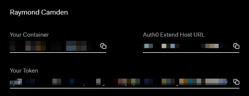
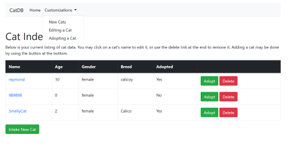
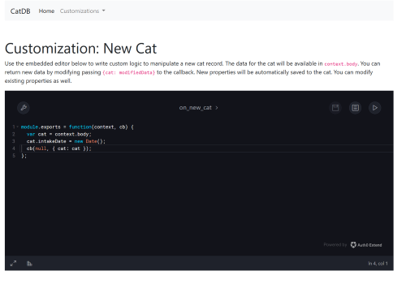
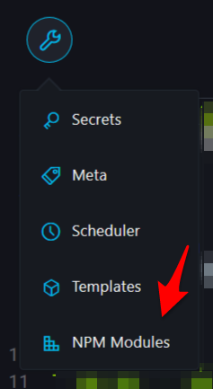
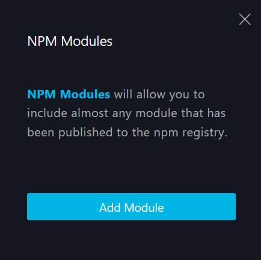
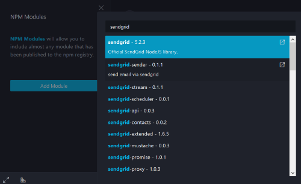
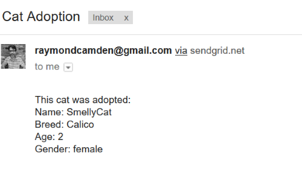

Working with LoopBack and Auth0 Extend
===

In this tutorial, I'm going to walk you through integrating [Auth0 Extend](https://auth0.com/extend/) into [LoopBack](https://loopback.io/). Don't worry if you've never been introduced to either of these. I'll give you a quick introduction to both and you'll have complete source code samples (DOWNLOAD LINK) to play with as you go along. Some basic JavaScript and Node experience is desirable but you don't have to be an expert (I'm certainly not!). You'll also want to get your [favorite code editor](https://code.visualstudio.com/) open as well. Ready to get started?

What is LoopBack?
--

Let's begin by taking a quick look at [LoopBack](https://loopback.io/). LoopBack describes itself as "The Node.js API Framework." That's a pithy way of saying it's focused on build APIs. How does that work? LoopBack begins by asking you to define a model. You can think of this as a basic description of your data. So if you were to work with cats, a model could look something like this:

	[
		{"name":"name", "type":"string", "required":true},
		{"name":"age", "type":"number", "required":true},
		{"name":"breed", "type":"string", "required":false}
	]
		
I've defined a cat as having three properties: name, age, and breed. I've set types for each and whether or not each is required. Simple and readable. Where LoopBack becomes impressive is that it can take a simple definition like this and create a complete set of REST APIs for your model. So to be clear on what exactly that means:

* You define a model that describes your data...
* LoopBack creates REST end points to let you create, read, update, and delete your data.

Oh, and not only does it make all of those APIs for you, it also provides a search service out of the box (`find cats that are older then 5 and have a breen value of calico`) as well a full security model (`only logged in users can create cats but anyone can read them`). And to top things off, LoopBack comes with a "Explorer", a web-based interface that provides full tools for testing your APIs:

 It isn't out of the question to say you can have a complete backend server for a client-side or mobile app in mere minutes. Out of the box LoopBack will persist data to memory, but you can add adapters for all major persistence systems (both SQL and hipster NoSQL). And don't worry about being "locked in" to the default APIs LoopBack provides - there is a complete customization layer that allow you to tweak the APIs including removing and adding new ones.

While you won't need to for this tutorial, you can go over the [Getting Started](http://loopback.io/getting-started/) guide for LoopBack and peruse the extensive [documentation](http://loopback.io/doc/) as well. To make things easier for you, the zip you downloaded earlier has a complete LoopBack application up and running. Before we get into Auth0 Extend, let's take a tour through the existing application.

Assuming you've extracted the zip and have a command line open to the folder, you'll want to first run `npm i` to get all the dependencies installed. Go grab a cup of coffee while npm downloads the entire Internet. Once done, run `node .` to get it started. You should see this in your terminal:

	Web server listening at: http://localhost:3000
	Browse your REST API at http://localhost:3000/explorer

So why two URLs? The `/explorer` end point is where you would find the API explorer. The `/` end point is where you find whatever you may define for your application. LoopBack uses [Express](https://expressjs.com/) behind the scenes which means if your comfortable working with it you can use it within a LoopBack application as well. I've done this for the initial version of the application to provide a simple way of working with our data. Before going there though, look in the `common/models` folder. This is where LoopBack stores the definitions for models. Each model will have two files. A JSON file that defines the modal's properties and other settings and a JavaScript file for custom logic. Go ahead and open up `cat.json` to take a look at the model. (I removed a bit of the code for space.)

	{
	"name": "cat",
	"base": "PersistedModel",
	"idInjection": true,
	"options": {
		"validateUpsert": true
	},
	"properties": {
		"name": {
		"type": "string",
		"required": true
		},
		"age": {
		"type": "number",
		"required": true
		},
		"adopted": {
		"type": "boolean",
		"required": false
		},
		"breed": {
		"type": "string"
		},
		"gender": {
		"type": "string",
		"required": true
		}
	},
	"validations": [],
	"relations": {
		"owner": {
		"type": "belongsTo",
		"model": "appuser",
		"foreignKey": ""
		}
	},
	"acls": [
		...
	],
	"methods": {}
	}

Looking at this, even though there are probably multiple things that may not make sense to you, you can see that there are 5 properties defined for the cat model: name, age, adopted, breed, and gender. This is somewhat arbitrary of course and you can use whatever properties you want in your own applications. Also note you don't have to write this JSON by hand. LoopBack has a CLI that will generate everything for you.

So given that we have a cat model, LoopBack provides both the REST-based APIs to work with cats as well as a light weight "ORM" (Object Relational Mapping) system. Basically an abstraction layer to save you from writing SQL (or NoSQL) calls. Out of the box LoopBack can use an in memory database and persist it to a flat file. I've used that for this demo so you can jump right into testing. Open your browser to http://localhost:3000 and let's take a quick look.

The application begins with a simple login screen. You'll note I've nicely set a valid login and password as defaults because I hate typing in these things when working on an application. There's two valid users for the app, user1@google.com/user1 and user2@google.com/user2. Once logged in, you're presented with a list of cats (the cats you see immediately may be different):

From here you can click to add a new cat ("Intake New Cat"), you can edit a cat, or delete. The "Adopt" button simply sets the `adopted` property to true. It's a short cut representing business logic that saves the user time for a common operation. 

The code for all of this is basic Express routing and can be found in `server/boot/root.js`. You'll find the views in the `views` folder and I used Handlebars for the template language. If you logout (currently not supported, just kill and restart the server) and login as a different user, you'll see a unique set of data for that user.

So by itself, we've got a simple Node app that allows for CRUD (Create, Read, Update, and Delete) of cat data. We actually aren't using the APIs for the app, but they exist and could be employed by the users to get their data. However, what if they want more control over their use of this application? What if they needed various customizations? This is where Auth0 Extend enters.

Adding Customizations with Auth0 Extend
--

Lets quickly recap what we currently have. We have an application that lets users login and manage an inventory of cats. It's a simple CRUD system that handles basic data management, and that's it. You can imagine releasing this to your clients, patting yourself on the back for a job well done.

And then it happens.

First, one user asks if they can modify the validation logic.

Then another user asks if they can add an "alert" system for when an adoption occurs. 

Again and again you run into clients of your application who need small (well, small to them) tweaks to the basic behavior of your application in order to fit their business needs. 

One possible solution would be to use web hooks. In that scenario, you let the user enter the URL of an API they manage and you update your code to hit their API. That works, but puts the onus on the client to setup and manage a server just to handle a simple bit of logic. 

[Auth0 Extend](https://auth0.com/extend/) solves this problem by providing a service that allows you to add customizations (extension points) to your application that your own users can manage. In some ways you can think of it as a serverless platform as a service, but instead of a generic system like Amazon Lamdda, Auth0 Extend provides a much more focused platform tailored for your users. 

Auth0 Extend has very deep customization and security support, but we can walk through the process of setting up some simple "extension points" to the application. In order to proceed, you will want to click the "Sign Up" button on the upper right hand of the screen. When done, you'll end up on a screen with this information:

Make note of the values as you'll need them later. Also note that the code I'll be showing can be found, in it's completed form, in the `end` folder in the zip file you downloaded for this tutorial. The only changes you will need to make is including your credentials. 

The first thing we need to do is identify where we want to add support for Auth0 Extend. In our fictitious scenario here, we will add three different customizations:

* First, we will provide a way to add custom logic when a cat is created. LoopBack provides a simple way to hook into that event (conventiently called [operation hooks](https://loopback.io/doc/en/lb3/Operation-hooks.html)).
* Next, we'll add similar support for handling the edit of a cat. 
* Finally, we'll add support to do something custom when a cat is adopted.

I began by adding a bit of UI to the site, in this case, a simple top level menu:

The drop down menu has three links, one for each of the customizations we'll support with Auth0 Extend. Now we need to actually build support for the extension. There's 2 main things we'll need to do.

1) First, we need to provide a way to let the user edit custom code. Auth0 Extend provides a web based editor that is incredibly simple to use. It is incredibly powerful - allowing for debugging, testing, and more. 
2) We then need to add support to call the custom code saved by the user. That part will depend on your platform. In general, it is "just" a HTTP call, but obviously how you do that will depend on your particular server-side code.

For the first customization, we told the Node app to load a view called `ext_new.handlebars`. Let's look at that.

	<h1>Customization: New Cat</h1>

	

		Use the embedded editor below to write custom logic to manipulate a new cat record. The data for the cat will
		be available in <code>context.body</code>. You can return new data by modifying passing <code>{cat: modifiedData}</code> to the callback. New properties will be automatically saved to the cat. You can modify existing properties as well.
	

	

	

The stuff on top is simple text, but notice we've used it as a way to provide some direction to the user. The important part is the JavaScript code below. This code will add the embedded editor onto the web page. You need to change both the `webtaskContainer` and `token` values to match the keys you were given earlier. Also note the `webtaskName` value. This gives a label to the extension being used, in this case one that will handle logic for new cats. So how does it look?

You've got a miniature JavaScript editor right in the browser. You'll get color coding, warnings about syntax errors, and more as you type. The editor supports quite a bit out of the box and you have multiple options to configure what it shown to end users. For example, one of the features allows you to add metadata to your extension. This is useful for things like API keys. If you think this is not something your users will need, you can disable it. You also have control over the theme if you want to make it match your "corporate" style guide. 

Here's an example customization:

	http://localhost:3000/#module.exports = function(context, cb) {
	var cat = context.body;
	cat.intakeDate = new Date();
	cb(null, { cat: cat });
	};

In this case, we take the cat passed to the extension, add a new value (`intakeDate`), and return it. 

Now comes the crucial but. We've added in support for the user to write their extension, but then how do we use it? This part is specific to the application you've written. In our case, we can add code to LoopBack that runs when the cat is created. You can find this in `common/models/cat.js`. Here is that file, with part taken out for brevity:

	'use strict';

	const request = require('request');

	const auth0ExtendURL = 'fillmeout';
	const auth0Token = 'ditto';

	module.exports = function(Cat) {

		Cat.observe('before save', function(ctx, next) {

			if(ctx.isNewInstance) {

				let options = {
					method:'POST',
					url:auth0ExtendURL +'on_new_cat',
					headers:{'Authorization':`Bearer ${auth0Token}`},
					json:ctx.instance
				};

				request(options, function(error, response, body) {
					if(error) throw new Error(error);
					for(let key in body.cat) {
						ctx.instance[key] = body.cat[key];
					};

					next();
				});

			} else {
				
				//removed for now
				
			}

		});

	};

This is an example of what LoopBack calls an "operation hook". It lets you tie into any data related operation. LoopBack also supports "remote hooks" which are specific to API calls. In our case, we want to run some logic before a cat is added to the database (or in our case, a local file) so an operation hook makes sense. LoopBack passes data about the operation in the `ctx` argument and we've got a handy `isNewInstance` property we can check to recogognize a new cat.

In order to "run" the extension the user wrote, you need to specify two values up on top. The `auth0ExtendURL` one is a bit tricky. You need to take the container key you were given and add `.run.webtask.io`. So if your container key was 'ilikecats', then your URL would be: https://ilikecats.run.webtask.io/. The token value can be passed in as it was displayed to you. 

With these values, we can then make a request to the code and take the response. In this case we're assuming that the cat was modified somehow so we simply copy the properties over. 

The rest of the setup follows the same pattern. If you look at `ext_edit.handlerbars` and `ext_adopt.handlebars`, the only thing that changes is the introductory text and the `webtaskName` value for the editor. Let's instead go back to cat.js and look at the support for them within the operation hook:

	let options = {
		method:'POST',
		url:auth0ExtendURL +'on_edit_cat',
		headers:{'Authorization':`Bearer ${auth0Token}`},
		json:ctx.data
	};

	request(options, function(error, response, body) {
		if(error) throw new Error(error);

		if(body.error) {
			let err = new Error(body.message);
			err.statusCode = 400;
			next(err);
		} else {
			for(let key in body.cat) {
				ctx.data[key] = body.cat[key];
			};

			// now handle adoption
			if(ctx.data.adopted && !ctx.currentInstance.adopted) {
				console.log('do adoption');
				options.url = auth0ExtendURL + 'on_adopt_cat';
				request(options, function(error, response, body) { });						
			}
			next();
		}

	});

In this case, I've specified both "edit" and "adopt" extension support in one branch of the hook. First, I call `on_edit_cat`. Our docs for the extension suggest using it for validation so in this case, I'm looking for a returned error from their code. If `body.error` exists, then something wasn't valid and we can grab the message and return an error to LoopBack. Here's a good example of what that extension could look like:

	module.exports = function(context, cb) {
	var cat = context.body;
	if(cat.name === 'ray') {
		cb(new Error('Bad name!'));
	} else {
		cb(null, { cat: cat });
	}
	};

In this case, my custom validation doesn't like it when a cat is named ray. Not a particularly realistic example, but you can see right away how easy it is for a user to specify very particular logic rules. 

Finally, the "adopt" extension is a bit cool. Imagine you want to send an email when a cat is adopted. One way to do would be with the sendgrid npm module. Auth0 Extend lets you use any custom module you can find at npm. You begin by clicking the wrench icon:

Selecting `NPM Modules` opens a UI to let you add a new module:

Just click add and type "sendgrid"

Just select it and it will be added to the list of modules supported for the extension. Now you can use code like this:

	var SG_KEY = 'replace me with a sendgrid key';
	var helper = require('sendgrid').mail;

	module.exports = function(context, cb) {
		var cat = context.body;
		var from_email = new helper.Email('raymondcamden@gmail.com');
		var to_email = new helper.Email('raymondcamden@gmail.com');
		var subject = 'Cat Adoption';

		var content = `
	This cat was adopted:
	Name: ${cat.name}
	Breed: ${cat.breed}
	Age: ${cat.age}
	Gender: ${cat.gender}
	`;

		var mailContent = new helper.Content('text/plain', content);
		var mail = new helper.Mail(from_email, subject, to_email, mailContent);
		var sg = require('sendgrid')(SG_KEY);

		var request = sg.emptyRequest({
			method: 'POST',
			path: '/v3/mail/send',
			body: mail.toJSON()
		});
			
		sg.API(request, function(error, response) {
			if(error) {
				console.log(error.response.body);
			} else {
				//right now we do nothing really
				cb(null, context.body);
			}
		});
	
	
	};

In this case, the extension will send me an email with details about the cat that was just adopted. Be sure to change `SG_KEY` to a valid sendgrid and for the love of everything thats holy please change the email address as well. 

Going Further
---

