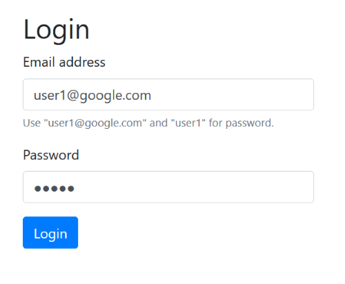

Working with LoopBack and Auth0 Extend
===

In this tutorial, I'm going to walk you through integrating [Auth0 Extend](https://auth0.com/extend/) into [LoopBack](https://loopback.io/). Don't worry if you've never been introduced to either of these. I'll give you a quick introduction to both and you'll have complete source code samples (DOWNLOAD LINK) to play with as you go along. Some basic JavaScript and Node experience is desirable but you don't have to be an expert (I'm certainly not!). You'll also want to get your [favorite code editor](https://code.visualstudio.com/) open as well. Ready to get started?

What is LoopBack?
--

Let's begin by taking a quick look at [LoopBack](https://loopback.io/). LoopBack describes itself as "The Node.js API Framework." That's a pithy way of saying it's focused on build APIs. How does that work? LoopBack begins by asking you to define a model. You can think of this as a basic description of your data. So if you were to work with cats, a model could look something like this:

	[
		{"name":"name", "type":"string", "required":true},
		{"name":"age", "type":"number", "required":true},
		{"name":"breed", "type":"string", "required":false}
	]
		
I've defined a cat as having three properties: name, age, and breed. I've set types for each and whether or not each is required. Simple and readable. Where LoopBack becomes impressive is that it can take a simple definition like this and create a complete set of REST APIs for your model. So to be clear on what exactly that means:

* You define a model that describes your data...
* LoopBack creates REST end points to let you create, read, update, and delete your data.

Oh, and not only does it make all of those APIs for you, it also provides a search service out of the box (`find cats that are older then 5 and have a breen value of calico`) as well a full security model (`only logged in users can create cats but anyone can read them`). And to top things off, LoopBack comes with a "Explorer", a web-based interface that provides full tools for testing your APIs:

 It isn't out of the question to say you can have a complete backend server for a client-side or mobile app in mere minutes. Out of the box LoopBack will persist data to memory, but you can add adapters for all major persistence systems (both SQL and hipster NoSQL). And don't worry about being "locked in" to the default APIs LoopBack provides - there is a complete customization layer that allow you to tweak the APIs including removing and adding new ones.

While you won't need to for this tutorial, you can go over the [Getting Started](http://loopback.io/getting-started/) guide for LoopBack and peruse the extensive [documentation](http://loopback.io/doc/) as well. To make things easier for you, the zip you downloaded earlier has a complete LoopBack application up and running. Before we get into Auth0 Extend, let's take a tour through the existing application.

Assuming you've extracted the zip and have a command line open to the folder, you'll want to first run `npm i` to get all the dependencies installed. Go grab a cup of coffee while npm downloads the entire Internet. Once done, run `node .` to get it started. You should see this in your terminal:

	Web server listening at: http://localhost:3000
	Browse your REST API at http://localhost:3000/explorer

So why two URLs? The `/explorer` end point is where you would find the API explorer. The `/` end point is where you find whatever you may define for your application. LoopBack uses [Express](https://expressjs.com/) behind the scenes which means if your comfortable working with it you can use it within a LoopBack application as well. I've done this for the initial version of the application to provide a simple way of working with our data. Before going there though, look in the `common/models` folder. This is where LoopBack stores the definitions for models. Each model will have two files. A JSON file that defines the modal's properties and other settings and a JavaScript file for custom logic. Go ahead and open up `cat.json` to take a look at the model. (I removed a bit of the code for space.)

	{
	"name": "cat",
	"base": "PersistedModel",
	"idInjection": true,
	"options": {
		"validateUpsert": true
	},
	"properties": {
		"name": {
		"type": "string",
		"required": true
		},
		"age": {
		"type": "number",
		"required": true
		},
		"adopted": {
		"type": "boolean",
		"required": false
		},
		"breed": {
		"type": "string"
		},
		"gender": {
		"type": "string",
		"required": true
		}
	},
	"validations": [],
	"relations": {
		"owner": {
		"type": "belongsTo",
		"model": "appuser",
		"foreignKey": ""
		}
	},
	"acls": [
		...
	],
	"methods": {}
	}

Looking at this, even though there are probably multiple things that may not make sense to you, you can see that there are 5 properties defined for the cat model: name, age, adopted, breed, and gender. This is somewhat arbitrary of course and you can use whatever properties you want in your own applications. Also note you don't have to write this JSON by hand. LoopBack has a CLI that will generate everything for you.

So given that we have a cat model, LoopBack provides both the REST-based APIs to work with cats as well as a light weight "ORM" (Object Relational Mapping) system. Basically an abstraction layer to save you from writing SQL (or NoSQL) calls. Out of the box LoopBack can use an in memory database and persist it to a flat file. I've used that for this demo so you can jump right into testing. Open your browser to http://localhost:3000 and let's take a quick look.

The application begins with a simple login screen. You'll note I've nicely set a valid login and password as defaults because I hate typing in these things when working on an application. There's two valid users for the app, user1@google.com/user1 and user2@google.com/user2. Once logged in, you're presented with a list of cats (the cats you see immediately may be different):

From here you can click to add a new cat ("Intake New Cat"), you can edit a cat, or delete. The "Adopt" button simply sets the `adopted` property to true. It's a short cut representing business logic that saves the user time for a common operation. 

The code for all of this is basic Express routing and can be found in `server/boot/root.js`. You'll find the views in the `views` folder and I used Handlebars for the template language. If you logout (currently not supported, just kill and restart the server) and login as a different user, you'll see a unique set of data for that user.

So by itself, we've got a simple Node app that allows for CRUD (Create, Read, Update, and Delete) of cat data. We actually aren't using the APIs for the app, but they exist and could be employed by the users to get their data. However, what if they want more control over their use of this application? What if they needed various customizations? This is where Auth0 Extend enters.

Adding Customizations with Auth0 Extend
--

